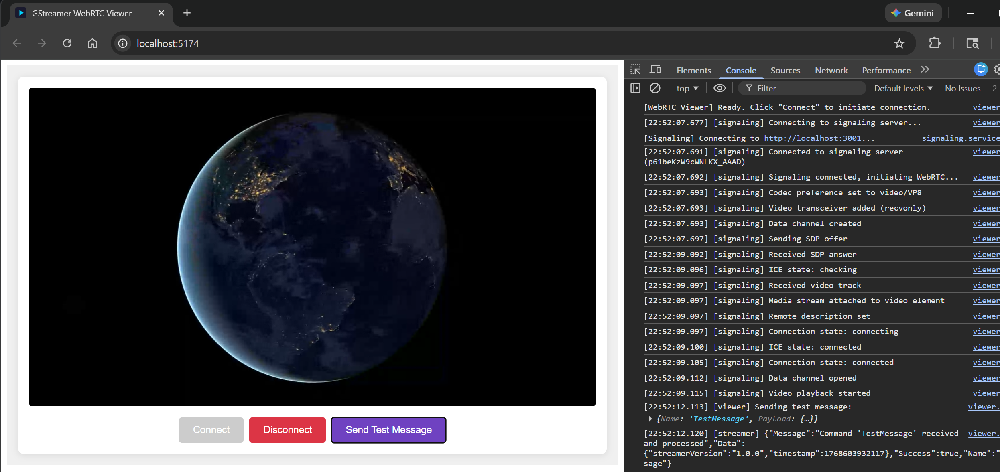

# GStreamer WebRTC POC

Simple but complete example for GStreamer with WebRTC integration.
The POC project has three components:

1. **Web Viewer** - Browser WebRTC client (web component, TypeScript)
2. **Signaling Server** - Socket.IO signaling for WebRTC negotiation (Node.JS, TypeScript)
3. **Video Streamer** - Console application that streams GStreamer video via WebRTC (Java)

**Demo:**


## Architecture

```
┌─────────────┐     WebSocket      ┌──────────────────┐     WebSocket      ┌─────────────────┐
│ Web Viewer  │ ◄────────────────► │ Signaling Server │ ◄────────────────► │ Video Streamer  │
│  (Browser)  │                    │   (Socket.IO)    │                    │   (GStreamer)   │
└─────────────┘                    └──────────────────┘                    └─────────────────┘
       ▲                                                                           │
       │                         WebRTC (Video + DataChannel)                      │
       └───────────────────────────────────────────────────────────────────────────┘
```

## Components

### Web Viewer

A TypeScript web component that displays the WebRTC video stream in the browser.

**Location:** `web-viewer/`

**Tech Stack:** TypeScript, Vite, Socket.IO Client, RxJS, Inversify

**Build & Run:**

```bash
cd web-viewer
npm install
npm run dev      # Development server at http://localhost:5173
npm run build    # Production build to dist/
npm run preview  # Preview production build
```

**Usage:**

The viewer is available as a web component `<webrtc-viewer>`:

```html
<webrtc-viewer></webrtc-viewer>

<!-- Or with custom signaling URL -->
<webrtc-viewer signaling-url="http://your-server:3001"></webrtc-viewer>
```

### Signaling Server

Simple Socket.IO-based signaling server for WebRTC negotiation between a single viewer-streamer pair.

**Location:** `signaling/`

**Tech Stack:** TypeScript, Express, Socket.IO

**Build & Run:**

```bash
cd signaling
npm install
npm run dev      # Development server at http://localhost:3001
npm run build    # Compile TypeScript to dist/
npm start        # Run compiled version
```

**Status endpoint:** `GET http://localhost:3001/` returns current connection status.

### Video Streamer

Java application using GStreamer to stream video via WebRTC.

**Location:** `video-streamer/`

**Tech Stack:** Java 17+, GStreamer 1.x, gst1-java-core, Socket.IO Client, Maven

**Prerequisites:**

- GStreamer 1.x installed with plugins: `vpx`, `rtp`, `webrtc`, `nice`, `dtls`, `srtp`
- On Ubuntu/Debian: `sudo apt install gstreamer1.0-plugins-base gstreamer1.0-plugins-good gstreamer1.0-plugins-bad gstreamer1.0-nice`

**Build & Run:**

```bash
cd video-streamer
mvn clean package

# Run with video file (default - requires earth_hd.mp4 in working directory)
java -jar target/video-streamer-1.0-SNAPSHOT-jar-with-dependencies.jar

# Run with test pattern
java -jar target/video-streamer-1.0-SNAPSHOT-jar-with-dependencies.jar --test-pattern
```

**Features:**

- Verifies GStreamer installation and required plugins at startup
- Two video source modes: test pattern or video file
- WebRTC data channel for bidirectional communication
- Handles keyboard, mouse, and wheel events from viewer
- Supports JSON messages with responses

## Quick Start

1. Start the signaling server (port 3001)
2. Start the video streamer
3. Start the web viewer: `cd web-viewer && npm run dev`
4. Open http://localhost:5173 in your browser
5. Click "Connect" to initiate the WebRTC connection

## Configuration

The web viewer can be configured via `web-viewer/src/viewer/config.ts`:

- `signalingUrl` - Signaling server URL (default: `http://localhost:3001`)
- `webrtc.preferredCodec` - Preferred video codec (VP8, H264, VP9)


TODO: Mention coturn and more link to gstreamer docs and some other examples I used.
